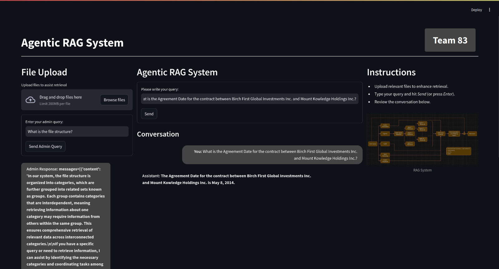
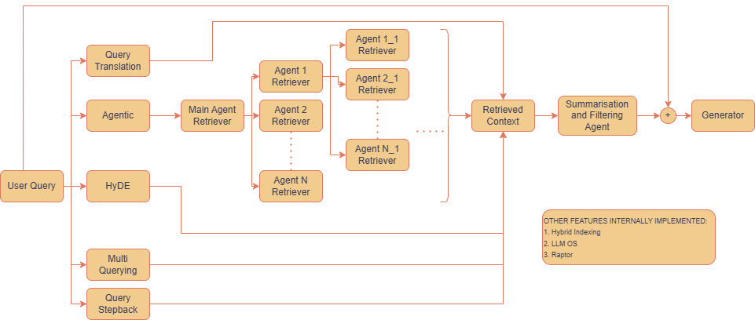

# Agentic Retrieval-Augmented Generation (RAG) System

## Overview
The **Agentic Retrieval-Augmented Generation (RAG) System** offers a novel architecture that is made for domain-specific queries. Here it is made for CUAD Dataset which is a financial and contracts dataset. A generalized model of the provided code can also be made by changing prompts. For a detailed working of the pipleine refer to `agentic_rag.pdf`.





---

## Installation Instructions

1. If Linux then create a python environment

   If Windows/MacOS then create a docker container of linux with python 3.10

2. Git clone this repo
3. Download the requirments in the python environment
   ```
   pip install -r requirments.txt
   ```
5. Download the [CUAD Dataset](https://www.atticusprojectai.org/cuad)
6. Move all PDFs and txt files in CUAD dataset into `data` folder in the working directory containing required documents for retrieval
7. Run the code using streamlit
   ```
   streamlit run app.py
   ```

---

##  Important Points

1. Code written is made for CUAD dataset and to perform retrieval for any files in it. If you want to use custom dataset and files then edit the `catgory.csv` to contain categories of questiosn 
   asked on your dataset. Also update the `metadata_filename_parties.csv` with filename and companies in your dataset.

2. Questions asked must contain name of comapnies involved, the pipelines searches the `metadata_filename_parties.csv` to find contract between them and answer the query. A exmaple question is
   `What is the Agreement Date for the contract between Birch First Global Investments Inc. and Mount Kowledge Holdings Inc.?`. 
  
3. For a detailed working of the pipleine refer to `agentic_rag.pdf` and pipleine diagram `diagram.jpg`.


---


<!-- ---

## Key Features

### 1. **Dual-Architecture Design**
- **Domain-Specific Architecture**: 
  - Optimized for structured datasets with interdependent categories.
  - Uses parallel subagents to reduce redundancy and retrieval cycles.
- **General Architecture**:
  - Tree-based retrieval for unstructured datasets.
  - Employs topological sorting and depth limits to prevent infinite loops.

### 2. **Dynamic Agent-Based Retrieval**
- Dynamically orchestrates sub-agents to explore datasets efficiently.
- Tailors exploration for diverse query types, ensuring optimal coverage.

### 3. **Enhanced Data Fusion and Summarization**
- Combines retrieved information into concise, token-efficient summaries.
- Balances detail and clarity, avoiding verbosity or incompleteness.

### 4. **Tool-Enhanced Generation**
- Incorporates tools like calculators, web search APIs, and external knowledge sources.
- Enhances accuracy and context for complex queries.

### 5. **Advanced Strategies**
- Includes RAPTOR indexing, multi-query RAG fusion, query decomposition, and stepback techniques.
- Ensures precise and adaptable responses for complex queries.

### 6. **Balanced Flexibility and Efficiency**
- Scales seamlessly across structured and unstructured datasets.
- Maintains a fine balance between efficiency and versatility.

--- -->
